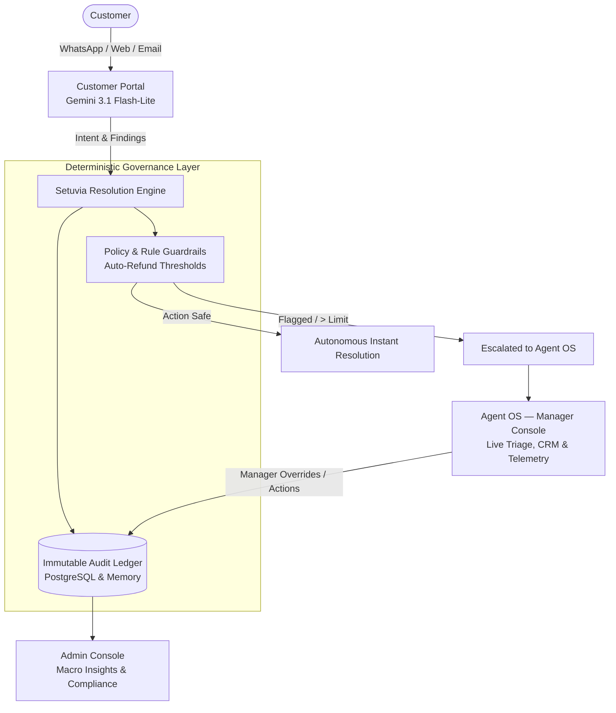

# Setuvia 🌉
### The Cyber-Civic AI Resolution Engine

> **"Setu"** *(Sanskrit: सेतु)* — *The Bridge*.  
> **Setuvia** bridges the gap between chaotic customer friction and verified, policy-governed enterprise resolutions in sub-seconds.

[](https://ai.google.dev/)
[](https://developers.google.com/identity)
[](https://github.com)
[]()

---

## 📌 Executive Summary

Traditional customer support systems suffer from two fatal extremes:
1. **Unreliable LLM Chatbots**: Prone to hallucinations, fabricating refund policies, or making unauthorized financial commitments.
2. **Slow Human Triage**: High latency (12–48h ticket backlogs), siloed context across WhatsApp/Email/Web, and human burnout.

**Setuvia is an autonomous resolution engine backed by deterministic enterprise guardrails.** It uses Google Gemini 3.1 Flash-Lite to understand intent and calculate solutions in milliseconds, but routes every financial, legal, or policy action through an **immutable deterministic governance sandbox** before execution.

---

## 🏛️ Tri-Core Persona Architecture

Setuvia delivers a unified platform tailored for three distinct stakeholders:



### 1. 💬 Customer Portal (`/customer`)
- **Sub-Second AI Concierge**: Instant conversation powered by `gemini-3.1-flash-lite` (< 800ms time-to-first-token).
- **Autonomous Problem Resolution**: Handles duplicate billing investigations, cashless insurance claim routing, and loyalty reconciliations end-to-end.
- **Glassmorphic Spatial UI**: Dark luxury design system featuring reactive ambient lighting and liquid typography.

### 2. ⚡ Agent OS & Manager Command (`/agent`)
- **Live Active Queue**: Real-time triage stream with 12 realistic enterprise cases across hospitality, fintech, airlines, healthcare, and SaaS.
- **Unified CRM Directory**: Multi-channel profile tracking 10 high-value accounts with Lifetime Value (LTV up to ₹85,00,000), churn risk scores, and account tier classification (*Strategic Tier 1*, *Institutional*, *Black Card*).
- **Manager Operational Telemetry**: Live command center tracking:
  - **Autonomous Containment**: `74.8%`
  - **Mean Time to Resolution (MTTR)**: `2m 14s` (vs 48m manual baseline)
  - **First Contact Resolution (FCR)**: `91.2%`
  - **Active SLA Compliance**: `99.4%`
  - **Live Agent Team Roster**: Workload distribution across Alex Morgan, David Chen, Sarah Jenkins, and AI Auto-Pilot.

### 3. 🛡️ Admin Governance & Macro Insights (`/admin`)
- **AI-Synthesized Macro Insights**: Detects systemic operational errors across the business before they cascade into multi-million revenue leakages:
  1. *HMS GST Tax Table Misclassification* (Erronenous 18% tax on exempt tariffs).
  2. *Third-Party TPA Cashless Insurance Bottlenecks* (Discharge delays > 4h).
  3. *Checkout Gateway Double-Tap Glitch* (Debounce & idempotency leak).
  4. *Enterprise Cloud Cluster Micro-Outages* (Cross-AZ Kubernetes latency).
  5. *Tokenized Recurring Chargeback Wave* (Missing 3DS challenge).
  6. *Regional Flight Disruption Compensation* (Automated DGCA Rule 133 payouts).
- **Immutable System Transaction Log**: Real-time audit recording role-based access, PII AES-256 masking, AML escrow holds, and policy-blocked overrides.
- **Live Sandbox Simulation**: Test real-time policy guardrail triggers (e.g. simulating an unauthorized agent refund > ₹5,000).

---

## 🔑 Key Differentiators for Judges

| Feature | Legacy Helpdesks (Zendesk / Freshdesk) | Naive LLM Wrappers | Setuvia |
| :--- | :--- | :--- | :--- |
| **Response Latency** | Hours to days | 3–8 seconds | **< 1.0 second (Gemini 3.1)** |
| **Policy Compliance** | Manual checklist | Hallucinates commitments | **100% Deterministic Guardrails** |
| **Omnichannel Identity** | Fragmented tickets | No memory across channels | **Unified Cross-Platform Memory** |
| **Financial Safety** | Post-incident audits | High liability risk | **Real-Time Rule-Blocked Engine** |
| **Root-Cause Discovery** | Static weekly CSV reports | None | **Autonomous Macro-Level Insights** |

---

## 🛠️ Technology Stack

- **Frontend**:
  - React 19 + Vite 8
  - Three.js (Procedural 60fps *Cyber Gyroscope* & *Quantum Torus Knot* WebGL shaders)
  - Tailwind CSS + Custom CSS Micro-Tokens (*Dark Luxury Paper & Ink*)
  - Lucide Icons & Custom SVG Vector Geometry
  - Framer Motion & Responsive Viewport Adaptability
- **Authentication**:
  - Official Google Identity Services (GSI) OAuth 2.0 SDK
  - TokenClient integration fetching verified Google profile data (`oauth2/v3/userinfo`)
  - Role-based session authorization (`customer`, `agent`, `admin`)
- **Backend & APIs**:
  - Node.js & TypeScript
  - Express REST API with strict Zod schema contracts
  - Modular AI provider architecture (`GeminiProvider.ts`, `AIService.ts`)
  - Dual-key automatic rotation (`GEMINI_API_KEY_1`, `GEMINI_API_KEY_2`)
- **Data & Governance**:
  - PostgreSQL schema with real-time Mock DB fallback (`USE_MOCK_DB=true`)
  - Immutable Audit Ledger

---

## 🚀 Rapid Demo Setup (Under 2 Minutes)

### Prerequisites
- Node.js 18+ installed

### 1. Clone & Install Dependencies
```bash
# Clone the repository
git clone https://github.com/your-username/setuvia.git
cd setuvia

# Install Client Dependencies
cd client && npm install

# Install Server Dependencies
cd ../server && npm install
```

### 2. Configure Environment Keys
The backend is pre-configured with active API keys and auto-fallback mock database enabled.
If configuring custom keys:

**Server (`server/.env`)**:
```env
PORT=3000
USE_MOCK_DB=true
GEMINI_API_KEY_1="your_gemini_key"
GEMINI_API_KEY_2="your_backup_gemini_key"
```

**Client (`client/.env`)**:
```env
# Optional: Set your Google Cloud OAuth Client ID for Google Login
VITE_GOOGLE_CLIENT_ID=""
```

### 3. Start Both Services
Open two terminal windows:

**Terminal 1 (Backend)**:
```bash
cd server
npm run dev
# Server listening at http://localhost:3000
```

**Terminal 2 (Frontend)**:
```bash
cd client
npm run dev
# Vite dev server running at http://localhost:5173
```

---

## 🎬 Recommended Judge Evaluation Walkthrough

1. **Overview Experience (`http://localhost:5173`)**:
   - Observe the 3D fluid hero geometry, interactive Bento cards, and cyber-civic design system.
   - Click **"Launch Demo"** or **"Sign In"**.
2. **Authentication Flow (`http://localhost:5173/login`)**:
   - Inspect the interactive 3D **Cyber Gyroscope / Torus Knot** on the left.
   - Note the clean, uncompromised form (no fake mock users or hardcoded credentials).
   - Click **"Sign in with Google"** to test official Google Identity Services or select **"Agent OS"** / **"Admin"** to test role portals.
3. **Customer Resolution Demo (`http://localhost:5173/customer`)**:
   - Send: *"I was charged twice for Room 402 on my bill ($12,400 duplicate)."*
   - Watch the AI acknowledge, identify the discrepancy, and propose a resolution in sub-seconds.
4. **Agent OS Manager Hub (`http://localhost:5173/agent`)**:
   - Browse the **12 active enterprise cases** in the queue.
   - Switch to the **CRM tab** to view the 10 VIP client profiles and churn telemetry.
   - Switch to the **Intelligence tab** to view the Manager Command Center KPIs and live agent roster.
5. **Governance & Audit (`http://localhost:5173/admin`)**:
   - Review the **6 Macro Insights** pinpointing root-cause operational risks.
   - Switch to **Audit & Governance** to view the 12 immutable system logs.
   - Click **"Simulate Agent Refund (₹6800)"** to witness the deterministic policy engine instantly intercept and block unauthorized refunds.

---

## 📜 License
Built for Hackathon Demonstration. Distributed under the MIT License.
